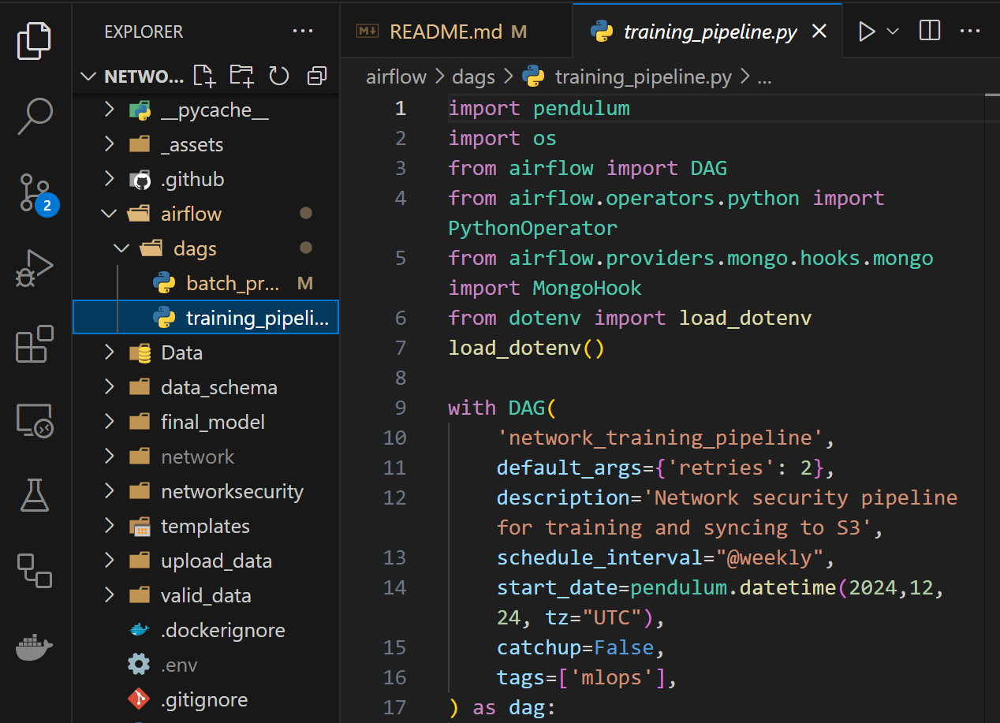

# MLOps Solution for Network Security in Malicious URL Detection

This is a comprehensive, end-to-end MLOps solution designed to detect and classify malicious URLs, ensuring user safety by identifying harmful links through machine learning. The solution integrates data ingestion, model training, deployment, and continuous monitoring, delivering both real-time and batch URL safety assessments, providing an automated, scalable approach to web security.

## Introduction

Malicious URLs are commonly used by cybercriminals in phishing attacks, social engineering schemes, and malware attacks, posing significant risks to individuals and organizations. The Malicious URL Detection project uses machine learning to identify and classify these harmful links, enabling timely interventions and improved web security. This solution includes a robust pipeline for detecting malicious URLs, offering both real-time single URL predictions and batch predictions through an interactive user interface. 

## Architecture


## Tech Stack 🛠️

| Category         | Tools/Technologies    | Description                                                                 |
|------------------|-----------------------|-----------------------------------------------------------------------------|
| Frontend         | Streamlit             | Provides a simple UI for real-time single URL predictions                   |
| Backend          | FastAPI               | Handles batch predictions and API endpoints                                 |
| Modeling         | RandomForestClassifier, Python       | Machine learning model for detecting malicious URLs                         |
| Database         | MongoDB               | Stores data records for ingestion and model training                         |
| Orchestration    | Apache Airflow        | Orchestrates training, retraining, and batch prediction pipelines            |
| Experiment Tracking| MLflow               | Tracks model metrics like F1-score, Precision, and Recall, with data stored in AWS S3 and running on AWS EC2 for scalable infrastructure         |
| CI/CD            | GitHub Actions        | Automates CI/CD pipelines, including Docker build and deployment            |
| Containerization | Docker, AWS ECR       | Docker images stored securely in ECR for consistent deployment              |
| Cloud Storage    | AWS S3                | Stores artifacts, trained models, and logs                                  |
| Cloud Hosting    | AWS EC2 Instance      | Serves as a self-hosted runner for GitHub Actions                           |

# Project Highlights 🌟

## ML Pipeline & Monitoring

- **End-to-End MLOps Pipeline**  
  From data ingestion to deployment, ensuring seamless integration and automated workflows.

- **Real-time Single URL Predictions**  
  Users can instantly interact with the model via a **Streamlit** app for real-time safety assessments on individual URLs.

- **Batch Predictions for Large Datasets**  
  Efficiently process multiple URLs at once using **FastAPI**, designed for batch predictions.

- **Automated Model Retraining**  
  Ensure that the model stays up-to-date with new data through an **Apache Airflow** powered retraining pipeline, running at scheduled intervals or triggered manually.

- **Comprehensive Metrics Tracking**  
  All experiments are logged and tracked with **MLflow** in **AWS**, providing a centralized dashboard to compare and monitor model performance and facilitate easy experimentation.

## Infrastructure & Deployment

- **Containerized with Docker**  
  The entire application is containerized using **Docker**, ensuring consistent environments from development to production.

- **Artifact & Model Storage**  
  Models, artifacts, experiments and other intermediate data are securely stored in **AWS S3**, ready for deployment at any stage.

- **Scalable Cloud Deployment on AWS EC2**  
  Deployed on **AWS EC2 instances**, enabling scalable cloud infrastructure for reliable performance.

- **Multiple Deployment Options**  
  - **FastAPI** for efficient API endpoints. It includes two routes:  
    - **/train** for training the model with existing data.  
    - **/predict** for making batch predictions on input data.
  - **Streamlit** for an interactive web interface, enabling easy user interaction with the model for real-time predictions.

## CI/CD & Version Control

- **Automated CI/CD Pipeline**  
  Streamline the conversion, deployment, and management with a fully automated **GitHub Actions** pipeline, integrating with **AWS ECR** and **Amazon EC2**.
  - **Docker Image Build & Push**:  
  Converts the application into a Docker image and pushes it to **Amazon ECR**, ensuring consistent and traceable deployments.  
  - **Deployment to Production**:  
  Pulls the Docker image from **Amazon ECR** and deploys it to **AWS EC2** for scalable and reliable application performance.  

- **Version Control for Code and Data**  
  - **Code Versioning** via **Git** and **GitHub** ensures codebase is always up-to-date.
  - **Data Versioning** with tools for **schema tracking** and **drift detection**, ensuring high data quality and maintaining model integrity over time.

## Dataset and Features

### URL Features


The dataset contains 30 features extracted from URLs to classify them as Malicious, Suspicious or Safe.

### Key Features

| Feature Name           | Description                                                            |
|------------------------|------------------------------------------------------------------------|
| `having_IP_Address`     | Checks if URL contains IP address instead of domain name               |
| `URL_Length`            | Measures URL length; longer URLs often hide malicious content          |
| `Shortening_Service`    | Detects use of URL shortening services like `bit.ly`                    |
| `having_At_Symbol`      | Flags presence of '@' in URL                                           |
| `double_slash_redirecting` | Identifies multiple slashes after protocol                            |

<details>
<summary>Click here to view all features</summary>

| Feature Name           | Description                                                            |
|------------------------|------------------------------------------------------------------------|
| `Prefix_Suffix`         | Checks for dashes in domain                                            |
| `having_Sub_Domain`     | Counts number of subdomains                                             |
| `SSLfinal_State`        | Analyzes SSL certificate                                               |
| `Domain_registration_length` | Measures domain registration duration                               |
| `Favicon`               | Checks favicon source                                                  |
| `port`                  | Detects unusual ports                                                  |
| `HTTPS_token`           | Flags 'HTTPS' in domain name                                           |
| `Request_URL`           | Checks resource loading domains                                        |
| `URL_of_Anchor`         | Analyzes anchor tag destinations                                       |
| `Links_in_tags`         | Measures links in HTML tags                                            |
| `SFH`                   | Checks form handler locations                                          |
| `Submitting_to_email`   | Flags form submission to email                                         |
| `Abnormal_URL`          | Identifies URL-domain mismatches                                       |
| `Redirect`              | Counts redirections                                                     |
| `on_mouseover`          | Detects JavaScript events                                              |
| `RightClick`            | Identifies right-click disabling                                        |
| `popUpWindow`           | Flags popup windows                                                    |
| `Iframe`                | Detects invisible iframes                                              |
| `age_of_domain`         | Analyzes domain age                                                    |
| `DNSRecord`             | Checks DNS records                                                     |
| `web_traffic`           | Measures website traffic                                               |
| `Page_Rank`             | Checks page rank                                                        |
| `Google_Index`          | Identifies Google indexing                                              |
| `Links_pointing_to_page`| Counts inbound links                                                    |
| `Statistical_report`    | Flags reported suspicious activity                                     |

</details>

## Components

### 1. Frontend (Streamlit)
There is a live demo of this project using [Streamlit](https://streamlit.io/) which you can find [here](https://network-security-system-mlops-6nshvkcv8cxrngosbdlrhb.streamlit.app/). The Streamlit app provides an intuitive interface for users to predict single URLs as Malicious, Suspicious or Safe:


- Safe URL Example:


- Suspicious URL Example:


- Malicious URL Example:


### 2. Backend (FastAPI)
FastAPI handles the model's operational tasks, including triggering model training and supporting batch predictions:

 - Training Route: Exposes an endpoint that can be triggered to initiate the model training process. This can be invoked via FastAPI or automated through Airflow.

 - Batch Prediction Route: Allows users to upload CSV files containing multiple URLs for batch predictions. The system processes the file and returns the prediction results.

- API Documentation:


- Training Route:


- Training Execution:


- AWS S3 bucket named 'networksecurity3' where the artifacts, model.pkl file and preprocessor.pkl file are stored.


- Batch Prediction Route:


- Batch Prediction Execution:


- AWS S3 bucket named 'my-network-datasource-neeraj' where the CSV files uploaded by users to the POST /predict route are stored.


### 3. MLOps Pipeline

#### Data Ingestion
- MongoDB integration for data retrieval
- Exported the processed data to a feature store for further usage.
- Split the data into training and testing datasets, ensuring no data leakage.


2. **Data Validation**:
   - Validated the schema to ensure all required columns are present.
   - Checked numerical columns for correctness and detected **data drift** using statistical tests.
   - Generated detailed drift reports to monitor dataset consistency.

3. **Data Transformation**:
   - Applied preprocessing steps, such as imputing missing values using a **KNNImputer**.
   - Prepared the data into transformed **NumPy arrays** for model training.
   - Saved the transformation pipeline as an artifact for future use.
   - Saved the preprocessing pipeline as a **pickle file**.

4. **Model Training and Evaluation**:
   - Implemented a range of classification models, including Random Forest, Gradient Boosting, Decision Tree, Logistic Regression, and AdaBoost.
   - Performed hyperparameter tuning using **GridSearchCV** with predefined parameter grids for each model to enhance performance.
   - Trained and tested models on transformed datasets to ensure consistent preprocessing.
   - Compared the performance of different models using multiple evaluation metrics to ensure the most suitable model was selected for the task.
   - Saved the final trained model as a **pickle file**.
   - Evaluated metrics such as **Precision**, **Recall**, and **F1-score** for the model through multiple experiments, with results tracked using **MLflow**, which is hosted on **AWS**. 
    
    
   - MLflow experiments, models, and other artifacts are stored in a bucket named "mlflowtrackingnetwork" in an S3 bucket.
     

### 4. CI/CD Pipeline with GitHub Actions

The project leverages a robust **CI/CD pipeline** to automate the integration, delivery, and deployment processes, streamlining the development lifecycle. With **GitHub Actions**, every code update triggers automated workflows to test, build, and deploy the application efficiently and reliably.

- Using AWS EC2 instance as a Self-Hosted Runner for Github Actions
  
  

- Pipeline Stages:
  - Continuous Integration:
    
  - Continuous Delivery:
    
  - Continuous Deployment:
    

- Successful Pipeline Execution:


### 5. Docker Integration
- ECR Image Management


### 6. Airflow Integration

- Airflow Login:


- DAGs:
  - Batch Prediction DAG:
    
  - Training Pipeline DAG:
    

- DAG Overview:


- Training Pipeline DAG Execution:


- Batch Prediction DAG Execution:


---

## **How to Run the Project** 🚀

This section provides a step-by-step guide on how to set up and run the Malicious URL Detection project both locally and in a deployed environment.

### **Installation**

1. **Clone the Repository:**
   ```bash
   https://github.com/Neeraj876/network-security-system-mlops.git
   cd network-security-system-mlops
   ```
2. **Install Dependencies:**
   ```bash
   pip install -r requirements.txt
   ```

### **Local Setup**

1. **Start the Streamlit App:**
   - Launch the user interface for **single URL prediction**.
   ```bash
   streamlit run streamlit.py
   ```
2. **Run the FastAPI Backend:**
   - Start the API for handling **batch predictions**.
   ```bash
   uvicorn app:app --reload
   ```

### **Deployment**

1. **Build and Push Docker Image:**
   - Build the Docker image and push it to **AWS ECR**.
   ```bash
   docker build -t your-docker-image .
   docker tag your-docker-image:latest <AWS_ECR_URI>
   docker push <AWS_ECR_URI>
   ```
2. **Run Docker Container on EC2 Instance:**
   - Start the **AWS EC2** instance and run the container.
   ```bash
   docker run -d -p 80:8080 your-docker-image
   ```

### **Running the Project Components**
1. **Set up MLflow:**

   - Ensure **MLflow** is running on your **AWS EC2 instance**. This is crucial for tracking experiments, logging metrics, and storing model artifacts.

   - MLflow stores experiments, metrics (e.g., F1-score, Precision), and model artifacts in an **S3 bucket**.

1. **Data Ingestion:**
   - Start by fetching data from **MongoDB** using the `data_ingestion` module.

2. **Pipeline Execution:**
   - Use **Airflow DAGs** (`network_training_dag.py` and `network_prediction_dag.py`) to orchestrate data ingestion, training, and prediction.

3. **Batch Prediction:**
   - Run the **FastAPI** server and use the `/predict` route to upload a CSV file and receive predictions in **JSON** format.

4. **Single Prediction:**
   - Launch the **Streamlit** app for real-time prediction of a single URL.

5. **Monitoring:**
   - Track all experiments, model metrics (e.g., F1-score, Precision), and logs via the **MLflow UI**.

---


